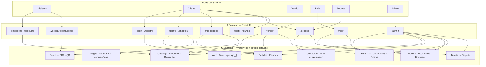
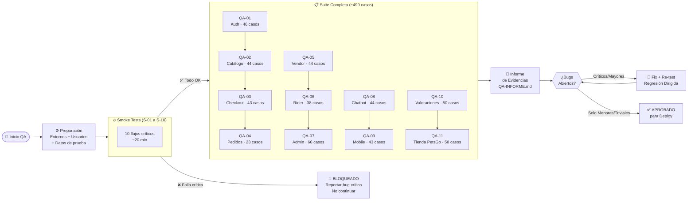
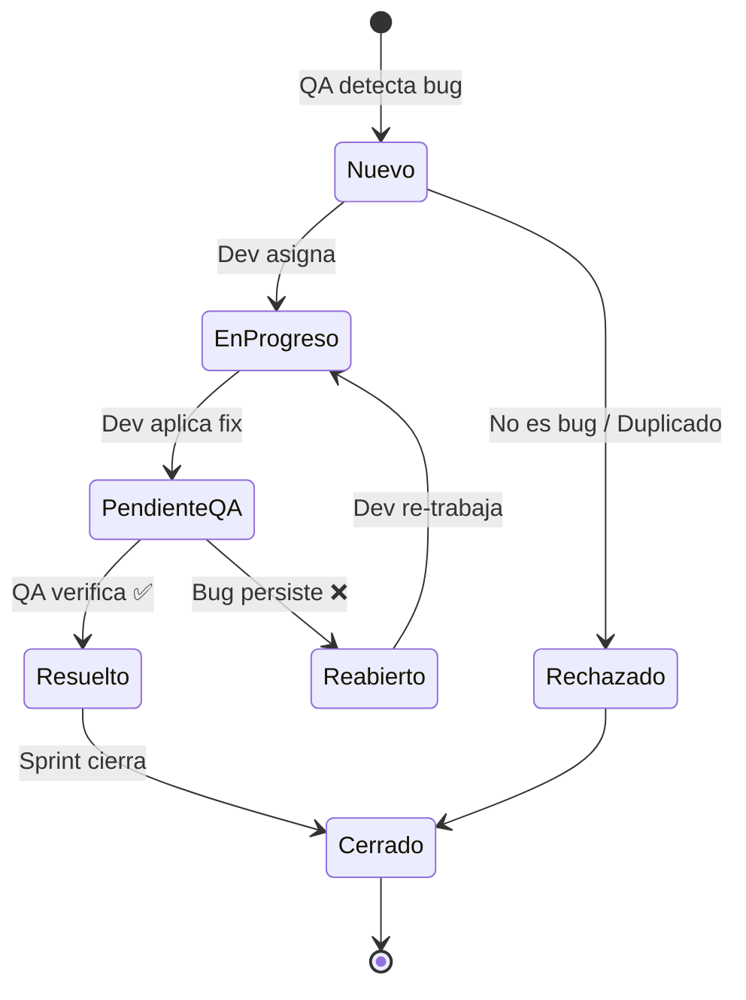
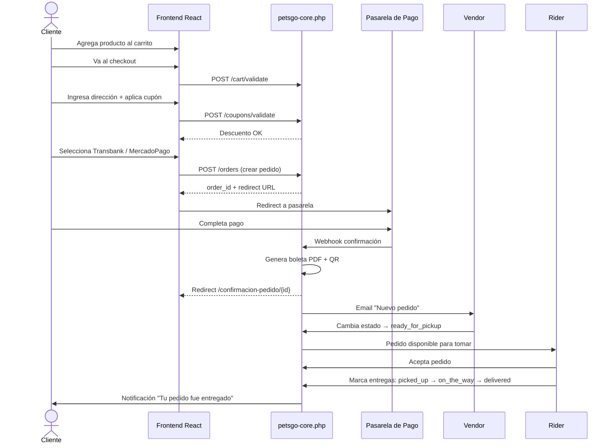

# QA-00 — Índice General y Entornos de Prueba
**Proyecto:** PetsGo — Marketplace de Productos para Mascotas  
**Versión:** 1.0  
**Fecha:** 2026-02-19  
**Responsable QA:** [Asignar]

---

## DIAGRAMA 1 — Arquitectura de Roles y Módulos



---

## DIAGRAMA 2 — Flujo de Ejecución QA



---

## DIAGRAMA 3 — Ciclo de Vida de Bug



---

## DIAGRAMA 4 — Flujo de Compra Completo (Happy Path)



---

## 1. ÍNDICE DE DOCUMENTOS QA

| Documento | Módulo | Total Casos | Archivo |
|---|---|---|---|
| QA-01 | Autenticación, Registro, Perfil, Mascotas | 46 | [QA-01-Autenticacion-Usuarios.md](QA-01-Autenticacion-Usuarios.md) |
| QA-02 | Catálogo, Productos, Búsqueda, Tiendas | 44 | [QA-02-Catalogo-Productos.md](QA-02-Catalogo-Productos.md) |
| QA-03 | Carrito, Checkout, Cupones, Pagos | 43 | [QA-03-Carrito-Checkout-Pagos.md](QA-03-Carrito-Checkout-Pagos.md) |
| QA-04 | Pedidos, Boletas Electrónicas, Verificación QR | 23 | [QA-04-Pedidos-Boletas.md](QA-04-Pedidos-Boletas.md) |
| QA-05 | Dashboard del Vendor (4 tabs + planes) | 44 | [QA-05-Dashboard-Vendor.md](QA-05-Dashboard-Vendor.md) |
| QA-06 | Dashboard del Rider (registro + entregas) | 38 | [QA-06-Dashboard-Rider.md](QA-06-Dashboard-Rider.md) |
| QA-07 | Panel de Administrador (11 secciones) | 66 | [QA-07-Panel-Admin.md](QA-07-Panel-Admin.md) |
| QA-08 | Chatbot IA, Multi-Conversación, Soporte/Tickets | 44 | [QA-08-Chatbot-Soporte.md](QA-08-Chatbot-Soporte.md) |
| QA-09 | Mobile y Diseño Responsivo | 43 | [QA-09-Mobile-Responsivo.md](QA-09-Mobile-Responsivo.md) |
| QA-10 | Valoraciones y Reseñas (Productos + Tiendas) | 50 | [QA-10-Valoraciones-Resenas.md](QA-10-Valoraciones-Resenas.md) |
| QA-11 | Tienda PetsGo (Admin como Vendedor) | 58 | [QA-11-Tienda-PetsGo-Admin.md](QA-11-Tienda-PetsGo-Admin.md) |
| **TOTAL** | | **~499 casos de prueba** | |

---

## 2. ENTORNOS DE PRUEBA

### 2.1 Entorno de Desarrollo (Local)

| Parámetro | Valor |
|---|---|
| URL Frontend | `http://localhost:5173` |
| URL WordPress API | `http://localhost/PetsGoDev` |
| Base de datos | MySQL local vía WAMP64 |
| DB Name | `petsgo_dev` (o la configurada en `wp-config.php`) |
| Método de pago disponible | `test_bypass` (modo sin pasarela real) |
| Branch Git | `develop` |
| Commit base QA | `cb8cf15` |

### 2.2 Entorno de Producción

| Parámetro | Valor |
|---|---|
| URL Frontend | `https://petsgo.cl` |
| URL WordPress API | `https://petsgo.cl/wp-json/petsgo/v1/` |
| Hosting | Hostinger |
| Base de datos | `u402745362_petsgo` |
| DB User | `u402745362_admin` |
| Métodos de pago | Transbank Webpay (producción) + MercadoPago |
| `test_bypass` | **NO disponible** |

---

## 3. USUARIOS DE PRUEBA

### 3.1 Usuarios Frontend (React App)

| Rol | Email | Contraseña | Notas |
|---|---|---|---|
| **Cliente** | `testclient@petsgo.cl` | `Test1234!` | Con historial de pedidos y mascotas |
| **Vendor Activo** | `testvendor@petsgo.cl` | `Test1234!` | Con 5+ productos y pedidos |
| **Vendor Inactivo** | `testvendor-inactive@petsgo.cl` | `Test1234!` | Para probar pantalla de cuenta inactiva |
| **Rider Aprobado** | `testrider@petsgo.cl` | `Test1234!` | Con historial de entregas |
| **Rider Pendiente** | `testrider-pending@petsgo.cl` | `Test1234!` | Status `pending_review` |
| **Soporte** | `testsupport@petsgo.cl` | `Test1234!` | Rol `petsgo_support` |

### 3.2 Administrador WordPress

| Acceso | Valor |
|---|---|
| URL wp-admin | `https://petsgo.cl/wp-admin/` |
| Usuario | *(usar credenciales del cliente)* |
| Nota | El admin también puede autenticarse en el frontend |

### 3.3 Tarjetas de Prueba — Transbank (Sandbox)

| Tipo | Número | Exp | CVV | Resultado |
|---|---|---|---|---|
| VISA aprobada | `4051 8856 0044 6623` | Cualquier futura | `123` | Aprobado |
| VISA rechazada | `4051 8842 3993 7763` | Cualquier futura | `123` | Rechazado |
| Mastercard | `5186 0595 5959 0568` | Cualquier futura | `123` | Aprobado |
| RUT validación | `11222333-4` | — | — | Para formulario Webpay |

### 3.4 Cuentas de Prueba — MercadoPago (Sandbox)

| Tipo | Número | Resultado |
|---|---|---|
| Visa aprobada | `4075 5957 1648 3764` | Aprobado |
| Mastercard aprobada | `5031 7557 3453 0604` | Aprobado |
| Visa rechazada | `4000 0000 0000 0002` | Rechazado |
| CVV | `123` | — |

---

## 4. DATOS DE PRUEBA REQUERIDOS

Antes de ejecutar las suites de prueba, asegurarse de tener creados en BD:

### 4.1 Productos de Prueba

```
- 1 producto simple activo con stock > 5
- 1 producto con variantes (talla S, M, L) activo
- 1 producto con precio de oferta activo  
- 1 producto sin stock (stock = 0)
- 1 producto inactivo (borrador)
- 3+ productos en una misma categoría
```

### 4.2 Pedidos de Prueba

```
- 1 pedido en status "pending" (sin pago)
- 1 pedido en status "processing" (pago confirmado)
- 1 pedido en status "delivered" (entregado)
- 1 pedido en status "cancelled" (cancelado)
- 1 pedido con boleta electrónica generada
```

### 4.3 Cupones de Prueba

```
- Cupón "TESTPCT20": 20% descuento, activo
- Cupón "TESTFIJO5000": $5.000 fijo, activo
- Cupón "TESTEXP": expirado (fecha pasada)
- Cupón "TESTMIN": mínimo de compra $50.000
- Cupón "TESTUNICO": un solo uso por cliente
```

### 4.4 Conversaciones del Chatbot

```
- 3+ conversaciones guardadas para testclient@petsgo.cl
- Con títulos distintos para probar búsqueda
```

---

## 5. PRIORIDADES DE EJECUCIÓN

### Sprint de Regresión (mínimo antes de deploy a prod)

Ejecutar **todos los casos de prioridad ALTA** de los siguientes módulos:

1. ✅ **QA-01** Autenticación (AU-040 a AU-049 + AU-120 a AU-126)
2. ✅ **QA-03** Carrito y Pagos (CC-001, CC-020, CC-080 a CC-085, CC-140 a CC-143)
3. ✅ **QA-04** Boletas (PB-060 a PB-065, PB-100 a PB-104)
4. ✅ **QA-08** Chatbot (CH-001, CH-040 a CH-044, CH-060 a CH-068)

### Suite Completa (ciclo QA completo)

Ejecutar **todos los casos** de todos los documentos, en este orden:

```
QA-01 → QA-02 → QA-03 → QA-04 → QA-05 → QA-06 → QA-07 → QA-08 → QA-09 → QA-10 → QA-11
```

---

## 6. TEMPLATE DE REPORTE DE BUG

```markdown
## Bug Report #[NUMERO]

**Título:** [Descripción corta del bug]  
**Documento:** QA-0X — [Nombre módulo]  
**Caso ID:** [Ej. AU-040]  
**Prioridad:** Alta / Media / Baja  
**Severidad:** Crítica / Mayor / Menor / Trivial  
**Estado:** Nuevo / En progreso / Resuelto / Cerrado  

### Entorno
- Browser: Chrome 121 / Firefox 122 / Safari 17
- Dispositivo: Desktop / Mobile (iPhone 14 / Samsung S23)
- Viewport: 1920×1080 / 375×812
- Entorno: Desarrollo / Producción
- Commit: cb8cf15 (u otro)

### Pasos para reproducir
1. paso 1
2. paso 2
3. paso 3

### Resultado Obtenido
[Lo que realmente ocurre]

### Resultado Esperado
[Lo que debería ocurrir según el caso de prueba]

### Capturas / Videos
[Adjuntar evidencia]

### Logs / Consola
```error
[Pegar error de consola del navegador si aplica]
```

### Notas adicionales
[Información extra relevante]
```

---

## 7. FLUJOS CRÍTICOS (SMOKE TESTS)

Los siguientes 10 flujos deben pasar antes de cualquier deploy a producción:

| # | Flujo | Pasos Clave |
|---|---|---|
| S-01 | Registro cliente → Login → Logout | AU-001, AU-040, AU-048 |
| S-02 | Búsqueda → Detalle de producto → Agregar al carrito | CA-060, CA-040, CC-001 |
| S-03 | Checkout completo con Transbank sandbox | CC-020 a CC-085 |
| S-04 | Pedido generado → Boleta descargable | PB-060, PB-083 |
| S-05 | QR de boleta verificable | PB-100, PB-101 |
| S-06 | Login vendor → Crear producto → Publicar | VD-001, VD-041 |
| S-07 | Pedido de vendor → Cambio de estado | VD-060, VD-062 |
| S-08 | Login rider → Aceptar pedido → Entregar | RD-020, RD-062, RD-083 |
| S-09 | Abrir chat → Enviar mensaje → Respuesta del bot | CH-001, CH-020, CH-023 |
| S-10 | Mobile: homepage → producto → carrito | MB-020, MB-060, MB-080 |

---

## 8. CONVENCIONES

### Estados esperados de pedido

| Código | Label en UI | Descripción |
|---|---|---|
| `pending` | Pendiente | Sin pago confirmado |
| `processing` | En proceso | Pago confirmado, vendor preparando |
| `ready_for_pickup` | Listo para retiro | Vendor listo, esperando rider |
| `on_the_way` | En camino | Rider en ruta |
| `delivered` | Entregado | Entrega confirmada |
| `cancelled` | Cancelado | Cancelado por cualquier parte |

### Roles del sistema

| Código interno | Nombre UI | WordPress Role |
|---|---|---|
| admin | Administrador | `administrator` |
| vendor | Vendedor / Proveedor | `petsgo_vendor` |
| rider | Repartidor | `petsgo_rider` |
| support | Soporte | `petsgo_support` |
| customer | Cliente | `subscriber` |

### Rutas del frontend

| Ruta | Módulo | Acceso |
|---|---|---|
| `/` | Homepage | Público |
| `/login` | Login | Público |
| `/registro` | Registro cliente | Público |
| `/registro-rider` | Registro rider | Público |
| `/forgot-password` | Reset contraseña | Público |
| `/categorias` | Catálogo | Público |
| `/categoria/:slug` | Categoría | Público |
| `/producto/:slug` | Detalle producto | Público |
| `/tienda/:slug` | Tienda vendor | Público |
| `/buscar` | Resultados búsqueda | Público |
| `/carrito` | Carrito | Público |
| `/checkout` | Checkout | Requiere login o invitado |
| `/confirmacion-pedido/:id` | Confirmación | Post-pago |
| `/mis-pedidos` | Mis pedidos | Cliente |
| `/perfil` | Perfil | Cliente |
| `/verificar-boleta/:token` | Verificación QR | Público |
| `/planes` | Planes vendor | Público |
| `/soporte` | Soporte/Tickets | Cliente / Support |
| `/terminos` | Términos y condiciones | Público |
| `/privacidad` | Política de privacidad | Público |
| `/vendor` | Dashboard vendor | Vendor |
| `/rider` | Dashboard rider | Rider |
| `/admin` | Panel admin | Admin |
