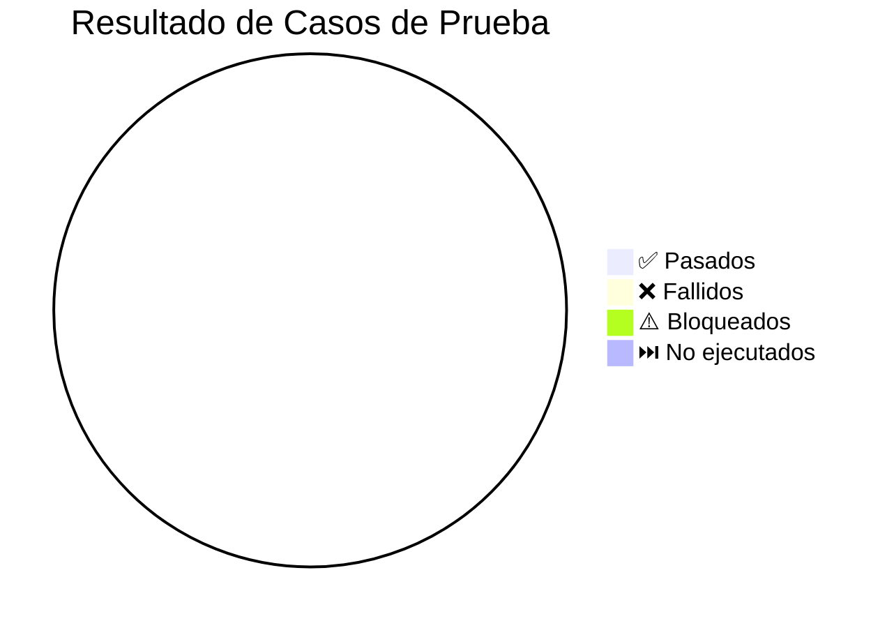
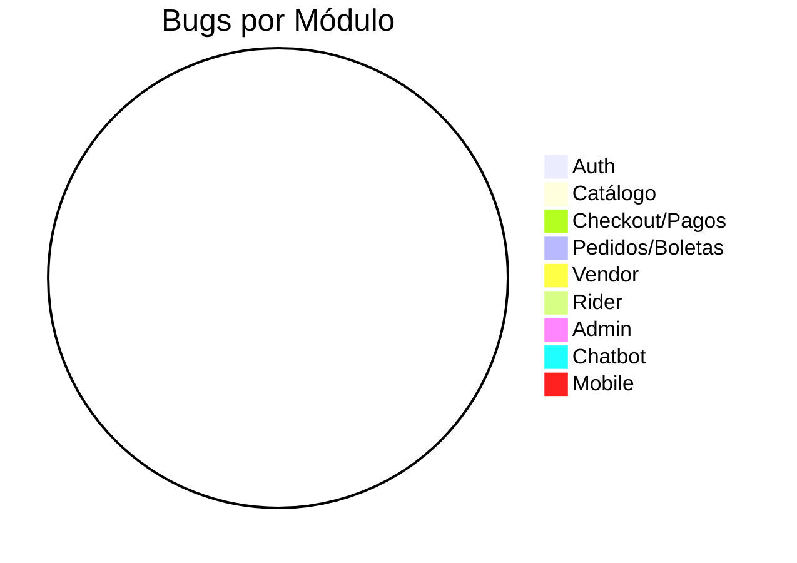

# INFORME DE PRUEBAS QA — PetsGo
**Proyecto:** PetsGo — Marketplace de Productos para Mascotas  
**Versión del sistema:** _______________  
**Commit probado:** _______________  
**Entorno:** ☐ Desarrollo `localhost` ☐ Producción `petsgo.cl`  
**Fecha de inicio:** _______________  
**Fecha de cierre:** _______________  
**QA Ejecutado por:** _______________  
**Revisado por:** _______________

---

## DIAGRAMA DE RESUMEN EJECUTIVO



> **Instrucción:** Reemplazar los `0` con los valores reales al finalizar cada suite.

---

## 1. RESUMEN EJECUTIVO

| Métrica | Valor |
|---|---|
| **Total de casos planificados** | 391 |
| **Casos ejecutados** | |
| **Casos pasados ✅** | |
| **Casos fallidos ❌** | |
| **Casos bloqueados ⚠️** | |
| **Casos no ejecutados ⏭️** | |
| **Tasa de éxito (Pass Rate)** | % |
| **Total de bugs reportados** | |
| **Bugs Críticos 🔴** | |
| **Bugs Mayores 🟠** | |
| **Bugs Menores 🟡** | |
| **Bugs Triviales ⚪** | |
| **Veredicto final** | ☐ APROBADO ☐ CONDICIONADO ☐ RECHAZADO |

### Criterios de Aprobación

| Criterio | Umbral | Resultado |
|---|---|---|
| Pass Rate general | ≥ 95% | |
| Bugs Críticos abiertos | 0 | |
| Bugs Mayores abiertos | ≤ 2 | |
| Smoke tests (S-01 a S-10) | 100% PASS | |
| Flujo de pago Transbank | 100% PASS | |

---

## 2. RESULTADOS POR MÓDULO

| Módulo | Doc | Total | ✅ Pass | ❌ Fail | ⚠️ Bloq. | Pass Rate |
|---|---|---|---|---|---|---|
| Autenticación y Usuarios | QA-01 | 46 | | | | |
| Catálogo y Productos | QA-02 | 44 | | | | |
| Carrito, Checkout y Pagos | QA-03 | 43 | | | | |
| Pedidos y Boletas | QA-04 | 23 | | | | |
| Dashboard Vendor | QA-05 | 44 | | | | |
| Dashboard Rider | QA-06 | 38 | | | | |
| Panel Admin | QA-07 | 66 | | | | |
| Chatbot y Soporte | QA-08 | 44 | | | | |
| Mobile y Responsivo | QA-09 | 43 | | | | |
| **TOTAL** | | **391** | | | | |

---

## 3. SMOKE TESTS — VERIFICACIÓN PREVIA

| ID | Flujo | Resultado | Tester | Fecha | Observación |
|---|---|---|---|---|---|
| S-01 | Registro → Login → Logout | ☐ PASS ☐ FAIL | | | |
| S-02 | Búsqueda → Detalle → Agregar al carrito | ☐ PASS ☐ FAIL | | | |
| S-03 | Checkout completo con Transbank sandbox | ☐ PASS ☐ FAIL | | | |
| S-04 | Pedido generado → Boleta descargable | ☐ PASS ☐ FAIL | | | |
| S-05 | QR de boleta verificable | ☐ PASS ☐ FAIL | | | |
| S-06 | Login vendor → Crear producto → Publicar | ☐ PASS ☐ FAIL | | | |
| S-07 | Vendor: pedido → Cambio de estado | ☐ PASS ☐ FAIL | | | |
| S-08 | Login rider → Aceptar pedido → Entregar | ☐ PASS ☐ FAIL | | | |
| S-09 | Abrir chat → Mensaje → Respuesta del bot | ☐ PASS ☐ FAIL | | | |
| S-10 | Mobile: homepage → producto → carrito | ☐ PASS ☐ FAIL | | | |

---

## 4. REGISTRO DE EJECUCIÓN DETALLADA

### QA-01 — Autenticación y Usuarios

| ID | Caso | Prioridad | Resultado | Tester | Fecha | Bug ID |
|---|---|---|---|---|---|---|
| AU-001 | Registro exitoso con todos los campos | Alta | ☐ PASS ☐ FAIL ☐ BLOQ | | | |
| AU-002 | Registro con email duplicado | Alta | ☐ PASS ☐ FAIL ☐ BLOQ | | | |
| AU-003 | Registro con RUT inválido | Alta | ☐ PASS ☐ FAIL ☐ BLOQ | | | |
| AU-040 | Login exitoso como cliente | Alta | ☐ PASS ☐ FAIL ☐ BLOQ | | | |
| AU-041 | Login exitoso como vendor | Alta | ☐ PASS ☐ FAIL ☐ BLOQ | | | |
| AU-042 | Login exitoso como rider aprobado | Alta | ☐ PASS ☐ FAIL ☐ BLOQ | | | |
| AU-043 | Login con contraseña incorrecta | Alta | ☐ PASS ☐ FAIL ☐ BLOQ | | | |
| AU-047 | Persistencia de sesión al refrescar | Alta | ☐ PASS ☐ FAIL ☐ BLOQ | | | |
| AU-048 | Logout limpia sesión | Alta | ☐ PASS ☐ FAIL ☐ BLOQ | | | |
| AU-120 | Cliente no accede a `/vendor` | Alta | ☐ PASS ☐ FAIL ☐ BLOQ | | | |
| AU-122 | Cliente no accede a `/admin` | Alta | ☐ PASS ☐ FAIL ☐ BLOQ | | | |
| AU-126 | Token PetsGo tiene prioridad sobre cookie WP | Alta | ☐ PASS ☐ FAIL ☐ BLOQ | | | |
| *[resto de casos AU-…]* | … | … | ☐ PASS ☐ FAIL ☐ BLOQ | | | |

### QA-02 — Catálogo y Productos

| ID | Caso | Prioridad | Resultado | Tester | Fecha | Bug ID |
|---|---|---|---|---|---|---|
| CA-021 | Ver productos de una categoría | Alta | ☐ PASS ☐ FAIL ☐ BLOQ | | | |
| CA-022 | Filtrar por precio | Alta | ☐ PASS ☐ FAIL ☐ BLOQ | | | |
| CA-040 | Ver detalle de producto simple | Alta | ☐ PASS ☐ FAIL ☐ BLOQ | | | |
| CA-042 | Selector de variantes | Alta | ☐ PASS ☐ FAIL ☐ BLOQ | | | |
| CA-043 | Variante sin stock bloquea carrito | Alta | ☐ PASS ☐ FAIL ☐ BLOQ | | | |
| CA-029 | Buscador mobile sin superposición | Alta | ☐ PASS ☐ FAIL ☐ BLOQ | | | |
| CA-100 | Crear producto simple (vendor) | Alta | ☐ PASS ☐ FAIL ☐ BLOQ | | | |
| CA-106 | Vendor no edita producto ajeno | Alta | ☐ PASS ☐ FAIL ☐ BLOQ | | | |
| *[resto de casos CA-…]* | … | … | ☐ PASS ☐ FAIL ☐ BLOQ | | | |

### QA-03 — Carrito, Checkout y Pagos

| ID | Caso | Prioridad | Resultado | Tester | Fecha | Bug ID |
|---|---|---|---|---|---|---|
| CC-001 | Agregar producto al carrito | Alta | ☐ PASS ☐ FAIL ☐ BLOQ | | | |
| CC-007 | Misma variante incrementa cantidad | Alta | ☐ PASS ☐ FAIL ☐ BLOQ | | | |
| CC-008 | Stock insuficiente bloquea cantidad | Alta | ☐ PASS ☐ FAIL ☐ BLOQ | | | |
| CC-040 | Aplicar cupón de porcentaje válido | Alta | ☐ PASS ☐ FAIL ☐ BLOQ | | | |
| CC-043 | Cupón expirado da error | Alta | ☐ PASS ☐ FAIL ☐ BLOQ | | | |
| CC-081 | Redirigir a Webpay | Alta | ☐ PASS ☐ FAIL ☐ BLOQ | | | |
| CC-082 | Pago exitoso Transbank sandbox | Alta | ☐ PASS ☐ FAIL ☐ BLOQ | | | |
| CC-083 | Pago rechazado Transbank | Alta | ☐ PASS ☐ FAIL ☐ BLOQ | | | |
| CC-121 | test_bypass NO disponible en producción | Alta | ☐ PASS ☐ FAIL ☐ BLOQ | | | |
| *[resto de casos CC-…]* | … | … | ☐ PASS ☐ FAIL ☐ BLOQ | | | |

### QA-04 — Pedidos y Boletas

| ID | Caso | Prioridad | Resultado | Tester | Fecha | Bug ID |
|---|---|---|---|---|---|---|
| PB-001 | Ver lista de pedidos propios | Alta | ☐ PASS ☐ FAIL ☐ BLOQ | | | |
| PB-005 | Cliente no ve pedidos ajenos | Alta | ☐ PASS ☐ FAIL ☐ BLOQ | | | |
| PB-060 | Boleta generada al confirmar pago | Alta | ☐ PASS ☐ FAIL ☐ BLOQ | | | |
| PB-062 | QR de boleta apunta a `/verificar-boleta/` | Alta | ☐ PASS ☐ FAIL ☐ BLOQ | | | |
| PB-080 | Cliente descarga su boleta | Alta | ☐ PASS ☐ FAIL ☐ BLOQ | | | |
| PB-100 | Verificar boleta con token válido | Alta | ☐ PASS ☐ FAIL ☐ BLOQ | | | |
| PB-101 | Verificar boleta con token inválido | Alta | ☐ PASS ☐ FAIL ☐ BLOQ | | | |
| PB-103 | Verificación sin login (pública) | Alta | ☐ PASS ☐ FAIL ☐ BLOQ | | | |
| *[resto de casos PB-…]* | … | … | ☐ PASS ☐ FAIL ☐ BLOQ | | | |

### QA-05 — Dashboard Vendor

| ID | Caso | Prioridad | Resultado | Tester | Fecha | Bug ID |
|---|---|---|---|---|---|---|
| VD-001 | Acceso exitoso vendor activo | Alta | ☐ PASS ☐ FAIL ☐ BLOQ | | | |
| VD-004 | Sesión persiste al refrescar F5 | Alta | ☐ PASS ☐ FAIL ☐ BLOQ | | | |
| VD-041 | Crear producto simple | Alta | ☐ PASS ☐ FAIL ☐ BLOQ | | | |
| VD-050 | Precio oferta debe ser menor al normal | Alta | ☐ PASS ☐ FAIL ☐ BLOQ | | | |
| VD-062 | Cambiar estado pedido a "En preparación" | Alta | ☐ PASS ☐ FAIL ☐ BLOQ | | | |
| VD-066 | Solo ver mis pedidos | Alta | ☐ PASS ☐ FAIL ☐ BLOQ | | | |
| VD-081 | Ver saldo pendiente de retiro | Alta | ☐ PASS ☐ FAIL ☐ BLOQ | | | |
| *[resto de casos VD-…]* | … | … | ☐ PASS ☐ FAIL ☐ BLOQ | | | |

### QA-06 — Dashboard Rider

| ID | Caso | Prioridad | Resultado | Tester | Fecha | Bug ID |
|---|---|---|---|---|---|---|
| RD-001 | Completar registro rider multi-paso | Alta | ☐ PASS ☐ FAIL ☐ BLOQ | | | |
| RD-004 | Rider aprobado tiene acceso completo | Alta | ☐ PASS ☐ FAIL ☐ BLOQ | | | |
| RD-022 | Refresh no expulsa a login | Alta | ☐ PASS ☐ FAIL ☐ BLOQ | | | |
| RD-062 | Aceptar pedido | Alta | ☐ PASS ☐ FAIL ☐ BLOQ | | | |
| RD-063 | Pedido ya tomado da error | Alta | ☐ PASS ☐ FAIL ☐ BLOQ | | | |
| RD-083 | Confirmar entrega exitosa | Alta | ☐ PASS ☐ FAIL ☐ BLOQ | | | |
| *[resto de casos RD-…]* | … | … | ☐ PASS ☐ FAIL ☐ BLOQ | | | |

### QA-07 — Panel Admin

| ID | Caso | Prioridad | Resultado | Tester | Fecha | Bug ID |
|---|---|---|---|---|---|---|
| AD-003 | Cliente no accede a `/admin` | Alta | ☐ PASS ☐ FAIL ☐ BLOQ | | | |
| AD-025 | Bloquear usuario | Alta | ☐ PASS ☐ FAIL ☐ BLOQ | | | |
| AD-041 | Aprobar vendor nuevo | Alta | ☐ PASS ☐ FAIL ☐ BLOQ | | | |
| AD-062 | Aprobar rider | Alta | ☐ PASS ☐ FAIL ☐ BLOQ | | | |
| AD-080 | Ver TODOS los pedidos | Alta | ☐ PASS ☐ FAIL ☐ BLOQ | | | |
| AD-086 | Cancelar pedido con reembolso | Alta | ☐ PASS ☐ FAIL ☐ BLOQ | | | |
| AD-140 | Crear cupón de porcentaje | Alta | ☐ PASS ☐ FAIL ☐ BLOQ | | | |
| *[resto de casos AD-…]* | … | … | ☐ PASS ☐ FAIL ☐ BLOQ | | | |

### QA-08 — Chatbot y Soporte

| ID | Caso | Prioridad | Resultado | Tester | Fecha | Bug ID |
|---|---|---|---|---|---|---|
| CH-001 | Abrir chatbot desde botón flotante | Alta | ☐ PASS ☐ FAIL ☐ BLOQ | | | |
| CH-002 | Botón "Chatear Ahora" abre chat | Alta | ☐ PASS ☐ FAIL ☐ BLOQ | | | |
| CH-040 | Invitado: persistencia 2h en localStorage | Alta | ☐ PASS ☐ FAIL ☐ BLOQ | | | |
| CH-042 | Cliente logueado: historial en BD | Alta | ☐ PASS ☐ FAIL ☐ BLOQ | | | |
| CH-060 | Panel de historial de conversaciones | Alta | ☐ PASS ☐ FAIL ☐ BLOQ | | | |
| CH-065 | Eliminar conversación del historial | Alta | ☐ PASS ☐ FAIL ☐ BLOQ | | | |
| CH-080 | Chat fullscreen en mobile ≤ 600px | Alta | ☐ PASS ☐ FAIL ☐ BLOQ | | | |
| CH-121 | Crear ticket de soporte | Alta | ☐ PASS ☐ FAIL ☐ BLOQ | | | |
| CH-128 | F5 en `/soporte` no expulsa | Alta | ☐ PASS ☐ FAIL ☐ BLOQ | | | |
| *[resto de casos CH-…]* | … | … | ☐ PASS ☐ FAIL ☐ BLOQ | | | |

### QA-09 — Mobile y Responsivo

| ID | Caso | Prioridad | Resultado | Tester | Fecha | Bug ID |
|---|---|---|---|---|---|---|
| MB-001 | Menú hamburguesa en mobile | Alta | ☐ PASS ☐ FAIL ☐ BLOQ | | | |
| MB-040 | CategoryPage: buscador full-width | Alta | ☐ PASS ☐ FAIL ☐ BLOQ | | | |
| MB-080 | Carrito usable en mobile | Alta | ☐ PASS ☐ FAIL ☐ BLOQ | | | |
| MB-100 | Chat fullscreen en ≤ 600px | Alta | ☐ PASS ☐ FAIL ☐ BLOQ | | | |
| MB-101 | Input chat no se cubre con teclado | Alta | ☐ PASS ☐ FAIL ☐ BLOQ | | | |
| *[resto de casos MB-…]* | … | … | ☐ PASS ☐ FAIL ☐ BLOQ | | | |

---

## 5. REGISTRO DE BUGS ENCONTRADOS

> Usar el template de la sección 6 de QA-00 para cada bug. Registrar aquí el resumen.

| Bug ID | Módulo | Caso QA | Título del Bug | Severidad | Estado | Asignado a | Fix en Commit |
|---|---|---|---|---|---|---|---|
| BUG-001 | | | | 🔴 Crítico | Nuevo | | |
| BUG-002 | | | | 🟠 Mayor | Nuevo | | |
| BUG-003 | | | | 🟡 Menor | Nuevo | | |
| … | | | | | | | |

### Distribución de bugs por módulo



---

## 6. EVIDENCIAS POR CASO DE PRUEBA

> Para cada caso fallido o de alta prioridad, adjuntar:

### Plantilla de evidencia

```
### [ID de Caso] — [Título del Caso]
**Resultado:** ✅ PASS / ❌ FAIL / ⚠️ BLOQUEADO
**Fecha:** YYYY-MM-DD  HH:MM
**Tester:** [Nombre]
**Entorno:** dev / prod
**Navegador:** Chrome 121 / Firefox 122 / Safari 17
**Dispositivo:** Desktop 1920×1080 / iPhone 14 / Samsung S23

**Captura de pantalla:**


**Logs de consola (si aplica):**
```
[Pegar error aquí]
```

**Observaciones:**
[Notas adicionales, comportamiento inesperado, pasos extras]

**Bug asociado:** BUG-XXX (si aplica)
```

---

### Evidencias — QA-01 Autenticación

#### AU-040 — Login exitoso como cliente
**Resultado:** ☐ PASS ☐ FAIL ☐ BLOQ  
**Fecha:**  
**Tester:**  
**Captura:** `./evidencias/AU-040.png`  
**Observaciones:**

---

#### AU-047 — Persistencia de sesión al refrescar
**Resultado:** ☐ PASS ☐ FAIL ☐ BLOQ  
**Fecha:**  
**Tester:**  
**Captura:** `./evidencias/AU-047.png`  
**Observaciones:**

---

### Evidencias — QA-03 Pagos

#### CC-082 — Pago exitoso Transbank sandbox
**Resultado:** ☐ PASS ☐ FAIL ☐ BLOQ  
**Fecha:**  
**Tester:**  
**Captura:** `./evidencias/CC-082.png`  
**Observaciones:**  

---

#### CC-083 — Pago rechazado Transbank
**Resultado:** ☐ PASS ☐ FAIL ☐ BLOQ  
**Fecha:**  
**Tester:**  
**Captura:** `./evidencias/CC-083.png`  
**Observaciones:**  

---

### Evidencias — QA-04 Boletas

#### PB-100 — Verificar boleta con token válido
**Resultado:** ☐ PASS ☐ FAIL ☐ BLOQ  
**Fecha:**  
**Tester:**  
**Captura:** `./evidencias/PB-100.png`  
**Observaciones:**  

---

#### PB-101 — Verificar boleta con token inválido
**Resultado:** ☐ PASS ☐ FAIL ☐ BLOQ  
**Fecha:**  
**Tester:**  
**Captura:** `./evidencias/PB-101.png`  
**Observaciones:**  

---

### Evidencias — QA-08 Chatbot

#### CH-060 — Panel de historial de conversaciones
**Resultado:** ☐ PASS ☐ FAIL ☐ BLOQ  
**Fecha:**  
**Tester:**  
**Captura:** `./evidencias/CH-060.png`  
**Observaciones:**  

---

### Evidencias — QA-09 Mobile

#### MB-100 — Chat fullscreen en ≤ 600px
**Resultado:** ☐ PASS ☐ FAIL ☐ BLOQ  
**Fecha:**  
**Tester:**  
**Captura:** `./evidencias/MB-100.png`  
**Observaciones:**  

---

## 7. CONCLUSIONES Y RECOMENDACIONES

### Veredicto Final

☐ **APROBADO** — El sistema cumple todos los criterios de aceptación. Puede desplegarse a producción.

☐ **CONDICIONADO** — El sistema puede desplegarse condicionado a la resolución de: [listar bugs bloqueantes].

☐ **RECHAZADO** — El sistema no puede desplegarse. Bugs críticos abiertos: [listar].

### Observaciones Generales

```
[Describir comportamientos generales observados, deuda técnica, recomendaciones de mejora]
```

### Próximos pasos

- [ ] Resolver bugs críticos antes del siguiente ciclo
- [ ] Re-testear casos fallidos después del fix
- [ ] Ejecutar regresión en módulos afectados por el fix
- [ ] Actualizar este informe con los resultados del re-test

---

## 8. FIRMAS DE APROBACIÓN

| Rol | Nombre | Firma | Fecha |
|---|---|---|---|
| QA Tester | | | |
| QA Lead | | | |
| Tech Lead / Dev | | | |
| Product Owner | | | |

---

*Documento generado para el proyecto PetsGo — `Docs/QA/QA-INFORME-EVIDENCIAS.md`*  
*Basado en los casos de prueba definidos en QA-00 a QA-09*
